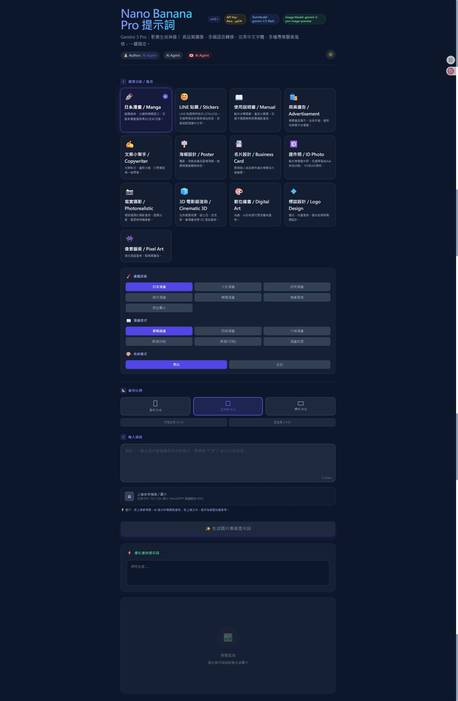

# NanoBananaProPrompt
提供 Nano Banana Pro 網頁界面，可以快速選擇輸出類型產生提示詞。    
目前提供:漫畫、LINE貼圖、商業廣告、海報設計、等等....  

## 配置
1. 需要配置 .env 檔案內的 Gemini API Key 環境變數  
    - GEMINI_3_API_KEY  
    - API Key 可以在 AI Studio 的 API Keys 中找到 `https://aistudio.google.com/api-keys`  
2. 需要安裝 Node.js  
    - v.22  
3. 需要執行 `npm install`  

## 使用
1. 需要執行 `npm run dev`  
2. 瀏覽 `http://localhost:3000`  

